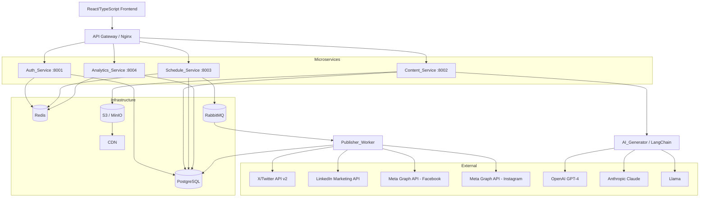

# Design Document: Social Media Automation System (SMAS)

## Overview

SMAS is an enterprise-grade microservices platform for scheduling and publishing social media content across X/Twitter, LinkedIn, Facebook Pages, and Instagram Business. It provides AI-assisted content generation, team-based approval workflows, analytics aggregation, and webhook integration.

The system is composed of four Fastify (Node.js/TypeScript) microservices (Auth, Content, Schedule, Analytics), a React 19/TypeScript frontend, a Publisher Worker process, and shared infrastructure (PostgreSQL, Redis, RabbitMQ, S3/MinIO).

### Key Design Decisions

- **Microservices over monolith**: Each domain (auth, content, scheduling, analytics) is independently deployable and scalable. Services communicate via RabbitMQ for async operations and direct HTTP for synchronous queries.
- **JWT + refresh token auth**: Stateless access tokens (short-lived) with Redis-backed refresh token rotation avoids session storage while supporting revocation.
- **RabbitMQ for publish queue**: Decouples scheduling from publishing, enabling retry logic and backpressure without blocking the Schedule_Service.
- **Redis for rate limiting and caching**: Atomic increment operations for rate limit counters; analytics cache avoids hammering Platform APIs on every request.
- **Node.js + Fastify for all backend services**: TypeScript throughout, Fastify for high-throughput HTTP, Prisma ORM for type-safe DB access, and `node-cron` for scheduled jobs.
- **LangChain.js abstraction**: Allows swapping AI backends (GPT-4, Claude, Llama) without changing Content_Service logic.

---

## Architecture



### Service Communication

- **Synchronous (HTTP)**: Frontend → API Gateway → Services for all user-facing operations.
- **Asynchronous (RabbitMQ)**: Schedule_Service enqueues publish jobs; Publisher_Worker consumes them. Webhook delivery also uses a queue for retry logic.
- **Cache (Redis)**: Rate limit counters (TTL-aligned to UTC midnight), analytics cache (1-hour TTL), JWT refresh token store.

---

## Components and Interfaces

### Auth_Service (port 8001)

Handles authentication, authorization, OAuth platform connections, RBAC, and audit logging.

```
POST   /auth/login                    → { access_token, refresh_token }
POST   /auth/refresh                  → { access_token }
POST   /auth/logout                   → 204
GET    /auth/oauth/{platform}/start   → redirect to platform OAuth URL
GET    /auth/oauth/{platform}/callback → store tokens, redirect to frontend
POST   /auth/oauth/{platform}/refresh → refresh platform token
GET    /users/me                      → UserProfile
GET    /audit-logs                    → AuditLogPage (Admin only)
```

### Content_Service (port 8002)

Manages posts, platform posts, media, and AI generation.

```
POST   /posts                         → Post
GET    /posts/{id}                    → Post
PUT    /posts/{id}                    → Post
DELETE /posts/{id}                    → 204
POST   /posts/{id}/submit-approval    → Post (status → pending_approval)
POST   /posts/{id}/approve            → Post (status → approved)
POST   /posts/{id}/reject             → Post (status → rejected)
POST   /ai/generate                   → AIDraft
POST   /media/upload                  → MediaAsset
DELETE /media/{id}                    → 204
```

### Schedule_Service (port 8003)

Manages schedules, rate limiting, and publish queue.

```
POST   /schedules                     → Schedule
DELETE /schedules/{id}                → 204 (reverts post to draft)
GET    /schedules/{post_id}           → Schedule
```

Internal cron job runs every 60 seconds to evaluate pending schedules and enqueue due posts.

### Analytics_Service (port 8004)

Aggregates and caches engagement metrics.

```
GET    /analytics/posts/{id}          → PostAnalytics
GET    /analytics/posts/{id}/platforms → PlatformAnalytics[]
```

Internal cron job refreshes metrics every 60 minutes.

### Publisher_Worker

Standalone process consuming from RabbitMQ `publish_queue`. For each message:
1. Fetch Post and Platform_Posts from DB.
2. For each target Platform, call the respective Platform API.
3. On success: update Platform_Post status to `published`, record platform post ID and timestamp.
4. On failure: update Platform_Post status to `failed`, record error. Schedule_Service handles retry via dead-letter queue with exponential backoff (up to 3 retries).

### AI_Generator

LangChain.js-based component invoked by Content_Service. Accepts `{ topic, platform, model }` and returns a draft string formatted to platform constraints. Supports GPT-4, Claude, and Llama backends via `@langchain/openai`, `@langchain/anthropic`, and Ollama. Timeout: 10 seconds per request.

### Media_Manager

Component within Content_Service. Handles upload validation, S3/MinIO storage, CDN URL generation, thumbnail/preview generation, and cleanup on post deletion.

### Webhook Dispatcher

Component within SMAS (can be co-located with Content_Service or as a separate worker). Listens for internal events and dispatches HTTP POST to registered webhook URLs. Signs payloads with HMAC-SHA256. Retries up to 3 times with exponential backoff. Disables webhook after 10 consecutive failures.

---

## Data Models

### PostgreSQL Schema

```sql
-- Users and Auth
CREATE TABLE users (
    id          UUID PRIMARY KEY DEFAULT gen_random_uuid(),
    email       TEXT UNIQUE NOT NULL,
    password_hash TEXT NOT NULL,
    role        TEXT NOT NULL CHECK (role IN ('admin', 'editor', 'viewer')),
    team_id     UUID REFERENCES teams(id),
    created_at  TIMESTAMPTZ NOT NULL DEFAULT now()
);

CREATE TABLE teams (
    id          UUID PRIMARY KEY DEFAULT gen_random_uuid(),
    name        TEXT NOT NULL,
    approval_workflow_enabled BOOLEAN NOT NULL DEFAULT false,
    created_at  TIMESTAMPTZ NOT NULL DEFAULT now()
);

CREATE TABLE refresh_tokens (
    id          UUID PRIMARY KEY DEFAULT gen_random_uuid(),
    user_id     UUID NOT NULL REFERENCES users(id) ON DELETE CASCADE,
    token_hash  TEXT NOT NULL,
    expires_at  TIMESTAMPTZ NOT NULL,
    revoked     BOOLEAN NOT NULL DEFAULT false
);

-- Platform Connections
CREATE TABLE platform_connections (
    id              UUID PRIMARY KEY DEFAULT gen_random_uuid(),
    user_id         UUID NOT NULL REFERENCES users(id) ON DELETE CASCADE,
    platform        TEXT NOT NULL CHECK (platform IN ('twitter', 'linkedin', 'facebook', 'instagram')),
    access_token    TEXT NOT NULL,  -- encrypted at rest
    refresh_token   TEXT,           -- encrypted at rest
    token_expires_at TIMESTAMPTZ,
    status          TEXT NOT NULL CHECK (status IN ('active', 'invalid')) DEFAULT 'active',
    platform_account_id TEXT NOT NULL,
    created_at      TIMESTAMPTZ NOT NULL DEFAULT now(),
    UNIQUE (user_id, platform, platform_account_id)
);

-- Posts
CREATE TABLE posts (
    id              UUID PRIMARY KEY DEFAULT gen_random_uuid(),
    team_id         UUID REFERENCES teams(id),
    created_by      UUID NOT NULL REFERENCES users(id),
    body            TEXT NOT NULL,
    original_ai_body TEXT,          -- preserved AI-generated text
    status          TEXT NOT NULL CHECK (status IN (
                        'draft', 'pending_approval', 'approved',
                        'rejected', 'scheduled', 'published', 'failed'
                    )) DEFAULT 'draft',
    target_platforms TEXT[] NOT NULL,
    created_at      TIMESTAMPTZ NOT NULL DEFAULT now(),
    updated_at      TIMESTAMPTZ NOT NULL DEFAULT now()
);

CREATE TABLE platform_posts (
    id                  UUID PRIMARY KEY DEFAULT gen_random_uuid(),
    post_id             UUID NOT NULL REFERENCES posts(id) ON DELETE CASCADE,
    platform            TEXT NOT NULL,
    platform_connection_id UUID NOT NULL REFERENCES platform_connections(id),
    status              TEXT NOT NULL CHECK (status IN ('pending', 'published', 'failed')) DEFAULT 'pending',
    platform_post_id    TEXT,       -- ID assigned by the platform after publish
    published_at        TIMESTAMPTZ,
    error_message       TEXT,
    retry_count         INT NOT NULL DEFAULT 0
);

-- Media
CREATE TABLE media (
    id          UUID PRIMARY KEY DEFAULT gen_random_uuid(),
    post_id     UUID REFERENCES posts(id) ON DELETE SET NULL,
    uploader_id UUID NOT NULL REFERENCES users(id),
    s3_key      TEXT NOT NULL,
    cdn_url     TEXT NOT NULL,
    mime_type   TEXT NOT NULL,
    file_size_bytes BIGINT NOT NULL,
    thumbnail_cdn_url TEXT,
    created_at  TIMESTAMPTZ NOT NULL DEFAULT now()
);

-- Schedules
CREATE TABLE schedules (
    id              UUID PRIMARY KEY DEFAULT gen_random_uuid(),
    post_id         UUID NOT NULL UNIQUE REFERENCES posts(id) ON DELETE CASCADE,
    scheduled_at    TIMESTAMPTZ NOT NULL,   -- stored with timezone
    timezone        TEXT NOT NULL,          -- IANA timezone string
    status          TEXT NOT NULL CHECK (status IN ('pending', 'enqueued', 'cancelled')) DEFAULT 'pending',
    created_at      TIMESTAMPTZ NOT NULL DEFAULT now()
);

-- Analytics
CREATE TABLE analytics_cache (
    id              UUID PRIMARY KEY DEFAULT gen_random_uuid(),
    platform_post_id UUID NOT NULL UNIQUE REFERENCES platform_posts(id),
    impressions     BIGINT NOT NULL DEFAULT 0,
    likes           BIGINT NOT NULL DEFAULT 0,
    shares          BIGINT NOT NULL DEFAULT 0,
    comments        BIGINT NOT NULL DEFAULT 0,
    clicks          BIGINT NOT NULL DEFAULT 0,
    last_refreshed_at TIMESTAMPTZ NOT NULL DEFAULT now()
);

-- Webhooks
CREATE TABLE webhooks (
    id          UUID PRIMARY KEY DEFAULT gen_random_uuid(),
    user_id     UUID NOT NULL REFERENCES users(id) ON DELETE CASCADE,
    url         TEXT NOT NULL,
    secret      TEXT NOT NULL,  -- used for HMAC-SHA256 signing
    event_types TEXT[] NOT NULL,
    enabled     BOOLEAN NOT NULL DEFAULT true,
    consecutive_failures INT NOT NULL DEFAULT 0,
    created_at  TIMESTAMPTZ NOT NULL DEFAULT now()
);

CREATE TABLE webhook_deliveries (
    id          UUID PRIMARY KEY DEFAULT gen_random_uuid(),
    webhook_id  UUID NOT NULL REFERENCES webhooks(id) ON DELETE CASCADE,
    event_type  TEXT NOT NULL,
    payload     JSONB NOT NULL,
    attempt     INT NOT NULL DEFAULT 1,
    status      TEXT NOT NULL CHECK (status IN ('pending', 'delivered', 'failed')),
    response_code INT,
    delivered_at TIMESTAMPTZ,
    created_at  TIMESTAMPTZ NOT NULL DEFAULT now()
);

-- Audit Logs (append-only)
CREATE TABLE audit_logs (
    id              UUID PRIMARY KEY DEFAULT gen_random_uuid(),
    user_id         UUID NOT NULL REFERENCES users(id),
    action_type     TEXT NOT NULL,
    resource_type   TEXT NOT NULL,
    resource_id     UUID NOT NULL,
    ip_address      INET NOT NULL,
    created_at      TIMESTAMPTZ NOT NULL DEFAULT now()
);
-- No UPDATE or DELETE privileges granted on audit_logs to any application role
```

### Redis Key Patterns

| Key Pattern | Value | TTL |
|---|---|---|
| `rate_limit:{platform_connection_id}:{YYYY-MM-DD}` | integer count | Until UTC midnight |
| `analytics:{platform_post_id}` | JSON metrics | 1 hour |
| `refresh_token:{token_hash}` | user_id | Token expiry |

### Platform Character Limits

| Platform | Character Limit |
|---|---|
| X/Twitter | 280 |
| LinkedIn | 3000 |
| Facebook | 63206 |
| Instagram | 2200 |

---

## Correctness Properties

*A property is a characteristic or behavior that should hold true across all valid executions of a system — essentially, a formal statement about what the system should do. Properties serve as the bridge between human-readable specifications and machine-verifiable correctness guarantees.*

### Property 1: JWT issuance on valid credentials

*For any* valid username/password pair, submitting those credentials to the login endpoint should return a response containing both a signed access token and a refresh token.

**Validates: Requirements 1.1**

### Property 2: Rejection on invalid credentials

*For any* credential pair where either the username does not exist or the password is incorrect, the login endpoint should return HTTP 401.

**Validates: Requirements 1.2**

### Property 3: Refresh token round trip

*For any* valid refresh token issued by the Auth_Service, submitting it to the refresh endpoint should return a new valid access token without requiring re-login.

**Validates: Requirements 1.3**

### Property 4: RBAC enforcement

*For any* protected endpoint and any user whose Role does not grant the required permission, the request should be rejected with HTTP 401 or 403.

**Validates: Requirements 1.4, 1.5**

### Property 5: Audit log completeness

*For any* create, update, or delete operation performed by any user, an audit log entry should exist containing the user ID, action type, resource type, resource ID, timestamp, and IP address.

**Validates: Requirements 1.6, 12.1, 12.2**

### Property 6: Platform_Post creation on post creation

*For any* Post created with N target platforms, exactly N Platform_Post records should be created, each with status `pending`.

**Validates: Requirements 4.2**

### Property 7: Published post update rejection

*For any* Post that has at least one Platform_Post with status `published`, an attempt to update the post body should return HTTP 409.

**Validates: Requirements 4.4**

### Property 8: Published post deletion rejection

*For any* Post with status `published`, an attempt to delete it should return HTTP 409.

**Validates: Requirements 4.6**

### Property 9: Platform character limit enforcement

*For any* Post body that exceeds the character limit of any target Platform, the Content_Service should reject the save and return a validation error.

**Validates: Requirements 4.7**

### Property 10: Media upload round trip

*For any* valid media file (accepted format and within size limits), uploading it should result in a CDN URL being stored and retrievable from the media table.

**Validates: Requirements 5.1**

### Property 11: Oversized video rejection

*For any* video file exceeding 512 MB, the upload endpoint should return HTTP 413.

**Validates: Requirements 5.4**

### Property 12: Unsupported format rejection

*For any* file whose MIME type is not in {JPEG, PNG, GIF, WebP, MP4, MOV}, the upload endpoint should return HTTP 415.

**Validates: Requirements 5.5**

### Property 13: Rate limit enforcement

*For any* Platform_Connection that has already published 50 posts in the current UTC calendar day, any further publish attempt for that connection should be rejected with a descriptive error.

**Validates: Requirements 7.2**

### Property 14: Rate limit reset at UTC midnight

*For any* Platform_Connection, after a UTC midnight boundary passes, the daily post count should reset to zero, allowing new publish attempts.

**Validates: Requirements 7.3**

### Property 15: Independent platform failure isolation

*For any* Post targeting multiple Platforms where one Platform API call fails, the failure should only affect the Platform_Post for that Platform; other Platform_Posts should proceed to `published` status independently.

**Validates: Requirements 8.3**

### Property 16: Approval gate enforcement

*For any* team with approval workflow enabled, a Post that has not reached `approved` status should not be enqueued for publication by the Schedule_Service.

**Validates: Requirements 9.2**

### Property 17: Pending approval edit lock

*For any* Post with status `pending_approval`, an attempt by the submitting Editor to edit the post body should be rejected.

**Validates: Requirements 9.6**

### Property 18: Analytics cache response time

*For any* request for cached analytics, the Analytics_Service should return a response within 200ms.

**Validates: Requirements 10.3**

### Property 19: Webhook HMAC signature validity

*For any* webhook delivery, the `X-SMAS-Signature` header should contain a valid HMAC-SHA256 signature of the payload using the per-webhook secret.

**Validates: Requirements 11.4**

### Property 20: Webhook auto-disable after consecutive failures

*For any* webhook endpoint that returns non-2xx responses for 10 consecutive delivery attempts, the webhook should be automatically disabled and the registering user notified.

**Validates: Requirements 11.5**

### Property 21: Audit log append-only invariant

*For any* audit log entry, no application role should be able to update or delete it; only inserts should succeed.

**Validates: Requirements 12.5**

---

## Error Handling

### Auth_Service

| Scenario | Response |
|---|---|
| Invalid credentials | HTTP 401 with `{ error: "invalid_credentials" }` |
| Missing/invalid JWT | HTTP 401 with `{ error: "unauthorized" }` |
| Insufficient role | HTTP 403 with `{ error: "forbidden" }` |
| OAuth refresh failure | Mark connection `invalid`, notify user, return HTTP 502 |
| Instagram Personal account | HTTP 400 with `{ error: "instagram_business_required" }` |
| LinkedIn Personal profile | HTTP 400 with `{ error: "linkedin_company_page_required" }` |

### Content_Service

| Scenario | Response |
|---|---|
| Update published post | HTTP 409 with `{ error: "post_already_published" }` |
| Delete published post | HTTP 409 with `{ error: "post_already_published" }` |
| Character limit exceeded | HTTP 422 with `{ error: "character_limit_exceeded", platform, limit, actual }` |
| AI backend unavailable | HTTP 503 with `{ error: "ai_backend_unavailable", backend }` within 10s |
| Edit pending_approval post | HTTP 409 with `{ error: "post_pending_approval" }` |

### Media_Manager

| Scenario | Response |
|---|---|
| File > 512 MB | HTTP 413 with `{ error: "file_too_large", max_bytes: 536870912 }` |
| Unsupported format | HTTP 415 with `{ error: "unsupported_media_type", accepted: [...] }` |

### Schedule_Service

| Scenario | Response |
|---|---|
| Rate limit reached | HTTP 429 with `{ error: "rate_limit_exceeded", resets_at: "<UTC midnight>" }` |
| Post would exceed rate limit | Notify user, retain post in `scheduled` status |
| Publisher failure (after 3 retries) | Mark Platform_Post `failed`, record error message |

### Analytics_Service

| Scenario | Response |
|---|---|
| Platform API rate limit during refresh | Retain cached metrics, log failure, no user-facing error |
| Cache miss | Fetch from DB, return last known values |

### Webhook Dispatcher

| Scenario | Behavior |
|---|---|
| Non-2xx or timeout | Retry up to 3 times with exponential backoff (1s, 2s, 4s) |
| 10 consecutive failures | Disable webhook, notify user |

### General

- All services return errors in `{ error: string, detail?: string }` JSON format.
- Unhandled exceptions return HTTP 500 with a generic message; details are logged internally.
- All inter-service HTTP calls have a 5-second timeout with circuit breaker pattern.

---

## Testing Strategy

### Dual Testing Approach

Both unit tests and property-based tests are required. They are complementary:
- **Unit tests** verify specific examples, integration points, and error conditions.
- **Property tests** verify universal correctness across randomized inputs.

### Unit Testing

Framework: **Vitest** for all backend services (Node.js/TypeScript) and the React 19 frontend.

Focus areas:
- OAuth flow integration (mock platform OAuth servers)
- Publisher_Worker dispatching to each platform API (mocked)
- Approval workflow state machine transitions
- Webhook HMAC signature generation and verification
- Media upload validation (format and size boundary conditions)
- Analytics aggregation across multiple platforms
- Audit log write path and query filters

### Property-Based Testing

Framework: **fast-check** (TypeScript) for all backend services.

Configuration: minimum **100 runs** per property test.

Each property test must include a comment tag in the format:
`// Feature: social-media-automation-system, Property {N}: {property_text}`

Property test mapping:

| Property | Test Description |
|---|---|
| P1: JWT issuance | Generate valid credential pairs → assert access + refresh tokens returned |
| P2: Invalid credential rejection | Generate invalid credentials → assert HTTP 401 |
| P3: Refresh token round trip | Issue token → refresh → assert new valid access token |
| P4: RBAC enforcement | Generate (endpoint, role) pairs without permission → assert 401/403 |
| P5: Audit log completeness | Generate CRUD operations → assert log entry fields present |
| P6: Platform_Post creation | Generate posts with N platforms → assert exactly N Platform_Posts with `pending` |
| P7: Published post update rejection | Generate published posts → assert update returns 409 |
| P8: Published post deletion rejection | Generate published posts → assert delete returns 409 |
| P9: Character limit enforcement | Generate bodies exceeding platform limits → assert validation error |
| P10: Media upload round trip | Generate valid media files → assert CDN URL stored and retrievable |
| P11: Oversized video rejection | Generate video files > 512 MB → assert HTTP 413 |
| P12: Unsupported format rejection | Generate files with invalid MIME types → assert HTTP 415 |
| P13: Rate limit enforcement | Simulate 50 publishes → assert 51st is rejected |
| P14: Rate limit reset | Simulate midnight boundary → assert count resets to 0 |
| P15: Platform failure isolation | Generate multi-platform posts with one failing → assert others succeed |
| P16: Approval gate enforcement | Generate posts in non-approved states → assert not enqueued |
| P17: Pending approval edit lock | Generate pending_approval posts → assert edit rejected |
| P18: Analytics cache response time | Generate analytics requests → assert response < 200ms |
| P19: Webhook HMAC validity | Generate payloads + secrets → assert HMAC-SHA256 signature correct |
| P20: Webhook auto-disable | Simulate 10 consecutive failures → assert webhook disabled |
| P21: Audit log append-only | Attempt UPDATE/DELETE on audit_logs → assert permission denied |

### Integration Testing

- End-to-end publish flow: create post → schedule → enqueue → publish → verify Platform_Post status.
- Approval workflow: submit → notify → approve/reject → verify state transitions.
- Rate limit boundary: publish 50 posts → verify 51st blocked → simulate midnight → verify reset.
- Webhook delivery: trigger event → verify signed HTTP POST received by test server.

### Test Data Strategy

- Use `fast-check` arbitraries to generate random UUIDs, strings, integers, and domain objects.
- Mock all external Platform APIs (Twitter, LinkedIn, Meta) using `msw` (Mock Service Worker) or `nock`.
- Use a dedicated test PostgreSQL database with Prisma migrations applied.
- Use `ioredis-mock` for Redis in unit/property tests.
- Use `amqplib` test utilities or an in-process RabbitMQ mock for queue tests.
