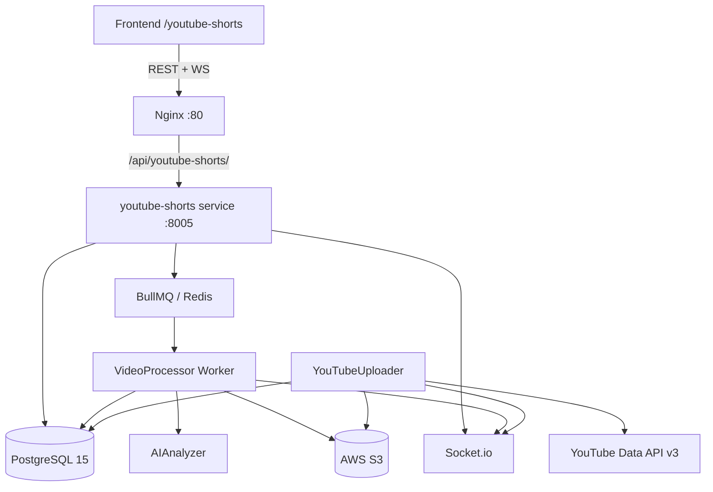

# Design Document: YouTube Shorts Automation

## Overview

The YouTube Shorts Automation module adds a dedicated microservice (`services/youtube-shorts`) to the existing SMAS platform. It accepts long-form YouTube video URLs, downloads and transcribes them, uses an LLM to identify highlight segments, renders each segment as a 9:16 vertical Short via FFmpeg, and uploads the results to the user's connected YouTube channel. Real-time progress is delivered over Socket.io WebSockets. The service shares the existing PostgreSQL 15 database (via Prisma), Redis 7 instance (for BullMQ queues and Socket.io adapter), and AWS S3-compatible storage.

The service runs on port **8005** and is exposed through the existing Nginx reverse proxy at `/api/youtube-shorts/`.

---

## Architecture



### Key Design Decisions

- **Express + TypeScript** (not Fastify) — consistent with the tech decision doc; other services use Fastify but the spec explicitly calls for Express here.
- **BullMQ** over RabbitMQ — the existing publisher worker uses RabbitMQ, but BullMQ on Redis is specified for this service to avoid adding a new dependency and to leverage Redis already in the stack.
- **In-process workers** — the VideoProcessor and AIAnalyzer run as BullMQ workers inside the same process as the Express server for simplicity; they can be split into a separate worker process later.
- **Socket.io with Redis adapter** — enables horizontal scaling; the existing Redis instance is reused.
- **AES-256-GCM** for OAuth token encryption — matches the requirement for encrypted-at-rest credentials, consistent with the existing `services/auth/src/utils/crypto.ts` pattern.

---

## Components and Interfaces

### 1. Express HTTP Server (`src/index.ts`)

Bootstraps the app, registers middleware (JWT auth, JSON body parser), mounts route handlers, initialises Socket.io, starts BullMQ workers, and runs Prisma migrations on startup.

```
GET  /health
POST /api/youtube-shorts/channels/connect          → initiate OAuth2
GET  /api/youtube-shorts/channels/callback         → OAuth2 callback
GET  /api/youtube-shorts/channels                  → list channels
DELETE /api/youtube-shorts/channels/:channelId     → disconnect channel

POST /api/youtube-shorts/jobs                      → submit job
GET  /api/youtube-shorts/jobs                      → list jobs (paginated)
GET  /api/youtube-shorts/jobs/:jobId               → get job + clips
DELETE /api/youtube-shorts/jobs/:jobId             → delete job
POST /api/youtube-shorts/jobs/:jobId/cancel        → cancel job

GET  /api/youtube-shorts/clips/:clipId             → get clip
PATCH /api/youtube-shorts/clips/:clipId            → update title/description
GET  /api/youtube-shorts/clips/:clipId/download    → pre-signed S3 URL
POST /api/youtube-shorts/clips/:clipId/upload      → trigger YouTube upload
POST /api/youtube-shorts/clips/:clipId/regenerate  → re-render clip
```

### 2. JobQueueService (`src/lib/queue.ts`)

Wraps BullMQ `Queue` and `Worker`. Defines two queues:

- `yt-video-jobs` — one job per `VideoJob`, processed by `VideoProcessor`
- `yt-clip-uploads` — one job per `ShortClip` upload, processed by `YouTubeUploader`

### 3. VideoProcessor (`src/workers/videoProcessor.ts`)

BullMQ worker consuming `yt-video-jobs`. Pipeline:

1. Download source video via `ytdl-core` to a temp directory
2. Validate duration (≤ 3 hours)
3. Transcribe with `whisper-node` → word-level timestamps
4. Call AIAnalyzer to get clip segments
5. For each segment: FFmpeg crop/scale to 1080×1920, optionally burn captions
6. Upload rendered file to S3
7. Create `ClipVariant` record
8. Emit progress WebSocket events throughout
9. Clean up temp files on completion/failure/cancellation

### 4. AIAnalyzer (`src/lib/aiAnalyzer.ts`)

Accepts a transcript + job config, calls OpenAI GPT-4 (or Anthropic Claude as fallback), returns an array of `ClipSegment`:

```typescript
interface ClipSegment {
  startSeconds: number;
  endSeconds: number;
  title: string;
  description: string;
  viralScore: number; // 0.0–1.0
}
```

Validates that each segment's duration is within `[minClipDuration, maxClipDuration]` and that the count does not exceed `maxClips`.

### 5. YouTubeUploader (`src/lib/youtubeUploader.ts`)

Handles Google OAuth2 flow and YouTube Data API v3 uploads. Uses `googleapis` SDK. Decrypts stored tokens before use, refreshes access token if within 5 minutes of expiry, re-encrypts and persists updated tokens after refresh.

### 6. Socket.io Gateway (`src/lib/socketGateway.ts`)

Initialises Socket.io server with the `@socket.io/redis-adapter` on the shared Redis instance. Authenticates connections via JWT middleware. Rooms are named by `userId` so events are scoped per user.

Emitted events:

| Event | Payload |
|---|---|
| `job:progress` | `{ jobId, status, stage, percentage }` |
| `job:clip_ready` | `{ jobId, clipId, thumbnailUrl, viralScore }` |
| `job:completed` | `{ jobId, clipIds[] }` |
| `job:failed` | `{ jobId, error }` |
| `clip:upload_progress` | `{ clipId, bytesUploaded, totalBytes }` |
| `clip:uploaded` | `{ clipId, youtubeVideoId, youtubeUrl }` |
| `channel:quota_warning` | `{ channelId, quotaUsed, quotaLimit }` |

### 7. Crypto Utility (`src/lib/crypto.ts`)

AES-256-GCM encrypt/decrypt for OAuth tokens. Each record gets a unique random IV stored alongside the ciphertext.

```typescript
interface EncryptedValue {
  iv: string;       // hex
  ciphertext: string; // hex
  authTag: string;  // hex
}

function encrypt(plaintext: string, key: Buffer): EncryptedValue
function decrypt(encrypted: EncryptedValue, key: Buffer): string
```

---

## Data Models

New Prisma models added to `shared/prisma/schema.prisma`:

```prisma
model YouTubeChannel {
  id                String    @id @default(dbgenerated("gen_random_uuid()")) @db.Uuid
  userId            String    @map("user_id") @db.Uuid
  googleAccountId   String    @map("google_account_id")
  channelTitle      String    @map("channel_title")
  thumbnailUrl      String?   @map("thumbnail_url")
  accessTokenEnc    String    @map("access_token_enc")   // AES-256-GCM ciphertext+iv+tag JSON
  refreshTokenEnc   String    @map("refresh_token_enc")
  tokenExpiresAt    DateTime  @map("token_expires_at") @db.Timestamptz
  quotaUsed         Int       @default(0) @map("quota_used")
  quotaResetAt      DateTime  @map("quota_reset_at") @db.Timestamptz
  createdAt         DateTime  @default(now()) @map("created_at") @db.Timestamptz
  user              User      @relation(fields: [userId], references: [id], onDelete: Cascade)
  videoJobs         VideoJob[]

  @@unique([userId, googleAccountId])
  @@map("youtube_channels")
}

model VideoJob {
  id               String         @id @default(dbgenerated("gen_random_uuid()")) @db.Uuid
  userId           String         @map("user_id") @db.Uuid
  channelId        String?        @map("channel_id") @db.Uuid
  youtubeUrl       String         @map("youtube_url")
  status           VideoJobStatus @default(pending)
  maxClips         Int            @default(5) @map("max_clips")
  minClipDuration  Int            @default(30) @map("min_clip_duration")
  maxClipDuration  Int            @default(60) @map("max_clip_duration")
  burnCaptions     Boolean        @default(false) @map("burn_captions")
  transcript       Json?
  errorReason      String?        @map("error_reason")
  createdAt        DateTime       @default(now()) @map("created_at") @db.Timestamptz
  updatedAt        DateTime       @updatedAt @map("updated_at") @db.Timestamptz
  user             User           @relation(fields: [userId], references: [id], onDelete: Cascade)
  channel          YouTubeChannel? @relation(fields: [channelId], references: [id], onDelete: SetNull)
  clips            ShortClip[]
  events           JobEvent[]

  @@map("video_jobs")
}

model ShortClip {
  id              String          @id @default(dbgenerated("gen_random_uuid()")) @db.Uuid
  jobId           String          @map("job_id") @db.Uuid
  userId          String          @map("user_id") @db.Uuid
  startSeconds    Float           @map("start_seconds")
  endSeconds      Float           @map("end_seconds")
  title           String
  description     String
  viralScore      Float           @map("viral_score")
  status          ShortClipStatus @default(pending)
  srtContent      String?         @map("srt_content")
  thumbnailUrl    String?         @map("thumbnail_url")
  youtubeVideoId  String?         @map("youtube_video_id")
  youtubeUrl      String?         @map("youtube_url")
  errorReason     String?         @map("error_reason")
  createdAt       DateTime        @default(now()) @map("created_at") @db.Timestamptz
  updatedAt       DateTime        @updatedAt @map("updated_at") @db.Timestamptz
  job             VideoJob        @relation(fields: [jobId], references: [id], onDelete: Cascade)
  user            User            @relation(fields: [userId], references: [id], onDelete: Cascade)
  variants        ClipVariant[]

  @@map("short_clips")
}

model ClipVariant {
  id          String    @id @default(dbgenerated("gen_random_uuid()")) @db.Uuid
  clipId      String    @map("clip_id") @db.Uuid
  s3Key       String    @map("s3_key")
  resolution  String                        // e.g. "1080x1920"
  durationSec Float     @map("duration_sec")
  fileSizeBytes BigInt  @map("file_size_bytes")
  createdAt   DateTime  @default(now()) @map("created_at") @db.Timestamptz
  clip        ShortClip @relation(fields: [clipId], references: [id], onDelete: Cascade)

  @@map("clip_variants")
}

model JobEvent {
  id        String   @id @default(dbgenerated("gen_random_uuid()")) @db.Uuid
  jobId     String   @map("job_id") @db.Uuid
  stage     String
  status    String
  message   String?
  createdAt DateTime @default(now()) @map("created_at") @db.Timestamptz
  job       VideoJob @relation(fields: [jobId], references: [id], onDelete: Cascade)

  @@map("job_events")
}

enum VideoJobStatus {
  pending
  processing
  completed
  failed
  cancelled
}

enum ShortClipStatus {
  pending
  processing
  rendered
  failed
  uploading
  uploaded
  upload_failed
}
```

New relations added to the existing `User` model:

```prisma
youtubeChannels YouTubeChannel[]
videoJobs       VideoJob[]
shortClips      ShortClip[]
```

### S3 Key Namespace

All clip files are stored under: `{userId}/{jobId}/{clipId}/clip.mp4`  
Thumbnails: `{userId}/{jobId}/{clipId}/thumbnail.jpg`

---
